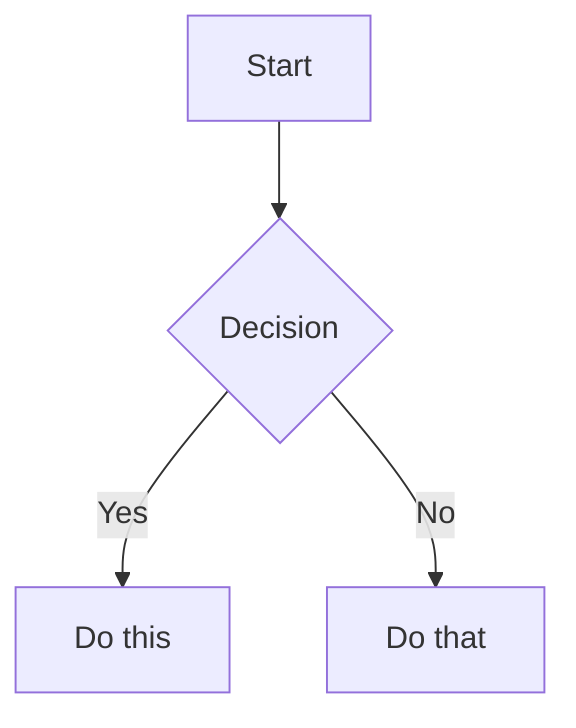

# Obsidian Skill

Create and edit valid Obsidian vault content across three formats: Obsidian Flavored Markdown (`.md`), Obsidian Bases (`.base`), and JSON Canvas (`.canvas`). This skill covers only Obsidian-specific extensions and formats — standard Markdown (headings, bold, italic, lists, quotes, code blocks, tables) is assumed knowledge.

---

## Part 1: Obsidian Flavored Markdown

### Workflow: Creating an Obsidian Note

1. **Add frontmatter** with properties (title, tags, aliases) at the top of the file. See [PROPERTIES.md](references/PROPERTIES.md).
2. **Write content** using standard Markdown plus Obsidian-specific syntax below.
3. **Link related notes** using wikilinks (`[[Note]]`) for internal vault connections, or standard Markdown links for external URLs.
4. **Embed content** from other notes, images, or PDFs using `![[embed]]` syntax. See [EMBEDS.md](references/EMBEDS.md).
5. **Add callouts** for highlighted information using `> [!type]` syntax. See [CALLOUTS.md](references/CALLOUTS.md).
6. **Verify** the note renders correctly in Obsidian's reading view.

> When choosing between wikilinks and Markdown links: use `[[wikilinks]]` for notes within the vault (Obsidian tracks renames automatically) and `[text](url)` for external URLs only.

### Internal Links (Wikilinks)

```markdown
[[Note Name]]                          Link to note
[[Note Name|Display Text]]             Custom display text
[[Note Name#Heading]]                  Link to heading
[[Note Name#^block-id]]                Link to block
[[#Heading in same note]]              Same-note heading link
```

Define a block ID by appending `^block-id` to any paragraph:

```markdown
This paragraph can be linked to. ^my-block-id
```

For lists and quotes, place the block ID on a separate line after the block:

```markdown
> A quote block

^quote-id
```

### Embeds

Prefix any wikilink with `!` to embed its content inline:

```markdown
![[Note Name]]                         Embed full note
![[Note Name#Heading]]                 Embed section
![[image.png]]                         Embed image
![[image.png|300]]                     Embed image with width
![[document.pdf#page=3]]               Embed PDF page
```

See [EMBEDS.md](references/EMBEDS.md) for audio, video, search embeds, and external images.

### Callouts

```markdown
> [!note]
> Basic callout.

> [!warning] Custom Title
> Callout with a custom title.

> [!faq]- Collapsed by default
> Foldable callout (- collapsed, + expanded).
```

Common types: `note`, `tip`, `warning`, `info`, `example`, `quote`, `bug`, `danger`, `success`, `failure`, `question`, `abstract`, `todo`.

See [CALLOUTS.md](references/CALLOUTS.md) for the full list with aliases, nesting, and custom CSS callouts.

### Properties (Frontmatter)

```yaml
---
title: My Note
date: 2024-01-15
tags:
  - project
  - active
aliases:
  - Alternative Name
cssclasses:
  - custom-class
---
```

Default properties: `tags` (searchable labels), `aliases` (alternative note names for link suggestions), `cssclasses` (CSS classes for styling).

See [PROPERTIES.md](references/PROPERTIES.md) for all property types, tag syntax rules, and advanced usage.

### Tags

```markdown
#tag                    Inline tag
#nested/tag             Nested tag with hierarchy
```

Tags can contain letters, numbers (not first character), underscores, hyphens, and forward slashes. Tags can also be defined in frontmatter under the `tags` property.

### Comments

```markdown
This is visible %%but this is hidden%% text.

%%
This entire block is hidden in reading view.
%%
```

### Obsidian-Specific Formatting

```markdown
==Highlighted text==                   Highlight syntax
```

### Math (LaTeX)

```markdown
Inline: $e^{i\pi} + 1 = 0$

Block:
$$
\frac{a}{b} = c
$$
```

### Diagrams (Mermaid)

````markdown

````

To link Mermaid nodes to Obsidian notes, add `class NodeName internal-link;`.

### Footnotes

```markdown
Text with a footnote[^1].

[^1]: Footnote content.

Inline footnote.^[This is inline.]
```

### Complete Markdown Example

````markdown
---
title: Project Alpha
date: 2024-01-15
tags:
  - project
  - active
status: in-progress
---

# Project Alpha

This project aims to [[improve workflow]] using modern techniques.

> [!important] Key Deadline
> The first milestone is due on ==January 30th==.

## Tasks

- [x] Initial planning
- [ ] Development phase
  - [ ] Backend implementation
  - [ ] Frontend design

## Notes

The algorithm uses $O(n \log n)$ sorting. See [[Algorithm Notes#Sorting]] for details.

![[Architecture Diagram.png|600]]

Reviewed in [[Meeting Notes 2024-01-10#Decisions]].
````

---

## Part 2: Obsidian Bases

### Workflow: Creating a Base

1. **Create the file**: Create a `.base` file in the vault with valid YAML content
2. **Define scope**: Add `filters` to select which notes appear (by tag, folder, property, or date)
3. **Add formulas** (optional): Define computed properties in the `formulas` section
4. **Configure views**: Add one or more views (`table`, `cards`, `list`, or `map`) with `order` specifying which properties to display
5. **Validate**: Verify the file is valid YAML with no syntax errors. Check that all referenced properties and formulas exist. Common issues: unquoted strings containing special YAML characters, mismatched quotes in formula expressions, referencing `formula.X` without defining `X` in `formulas`
6. **Test in Obsidian**: Open the `.base` file in Obsidian to confirm the view renders correctly

### Schema

Base files use the `.base` extension and contain valid YAML.

```yaml
# Global filters apply to ALL views in the base
filters:
  and: []
  or: []
  not: []

# Define formula properties that can be used across all views
formulas:
  formula_name: 'expression'

# Configure display names and settings for properties
properties:
  property_name:
    displayName: "Display Name"
  formula.formula_name:
    displayName: "Formula Display Name"
  file.ext:
    displayName: "Extension"

# Define custom summary formulas
summaries:
  custom_summary_name: 'values.mean().round(3)'

# Define one or more views
views:
  - type: table | cards | list | map
    name: "View Name"
    limit: 10                    # Optional: limit results
    groupBy:                     # Optional: group results
      property: property_name
      direction: ASC | DESC
    filters:                     # View-specific filters
      and: []
    order:                       # Properties to display in order
      - file.name
      - property_name
      - formula.formula_name
    summaries:                   # Map properties to summary formulas
      property_name: Average
```

### Filter Syntax

```yaml
# Single filter
filters: 'status == "done"'

# AND - all conditions must be true
filters:
  and:
    - 'status == "done"'
    - 'priority > 3'

# OR - any condition can be true
filters:
  or:
    - 'file.hasTag("book")'
    - 'file.hasTag("article")'

# NOT - exclude matching items
filters:
  not:
    - 'file.hasTag("archived")'

# Nested filters
filters:
  or:
    - file.hasTag("tag")
    - and:
        - file.hasTag("book")
        - file.hasLink("Textbook")
    - not:
        - file.hasTag("book")
        - file.inFolder("Required Reading")
```

### Filter Operators

| Operator | Description |
|----------|-------------|
| `==` | equals |
| `!=` | not equal |
| `>` | greater than |
| `<` | less than |
| `>=` | greater than or equal |
| `<=` | less than or equal |
| `&&` | logical and |
| `\|\|` | logical or |
| `!` | logical not |

### Properties

Three types of properties:

1. **Note properties** — From frontmatter: `note.author` or just `author`
2. **File properties** — File metadata: `file.name`, `file.mtime`, etc.
3. **Formula properties** — Computed values: `formula.my_formula`

#### File Properties Reference

| Property | Type | Description |
|----------|------|-------------|
| `file.name` | String | File name |
| `file.basename` | String | File name without extension |
| `file.path` | String | Full path to file |
| `file.folder` | String | Parent folder path |
| `file.ext` | String | File extension |
| `file.size` | Number | File size in bytes |
| `file.ctime` | Date | Created time |
| `file.mtime` | Date | Modified time |
| `file.tags` | List | All tags in file |
| `file.links` | List | Internal links in file |
| `file.backlinks` | List | Files linking to this file |
| `file.embeds` | List | Embeds in the note |
| `file.properties` | Object | All frontmatter properties |

### Formula Syntax

Formulas compute values from properties. Defined in the `formulas` section.

```yaml
formulas:
  # Simple arithmetic
  total: "price * quantity"

  # Conditional logic
  status_icon: 'if(done, "done", "pending")'

  # String formatting
  formatted_price: 'if(price, price.toFixed(2) + " dollars")'

  # Date formatting
  created: 'file.ctime.format("YYYY-MM-DD")'

  # Calculate days since created (use .days for Duration)
  days_old: '(now() - file.ctime).days'

  # Calculate days until due date
  days_until_due: 'if(due_date, (date(due_date) - today()).days, "")'
```

### Key Functions

Most commonly used functions. See [FUNCTIONS_REFERENCE.md](references/FUNCTIONS_REFERENCE.md) for the complete reference.

| Function | Signature | Description |
|----------|-----------|-------------|
| `date()` | `date(string): date` | Parse string to date (`YYYY-MM-DD HH:mm:ss`) |
| `now()` | `now(): date` | Current date and time |
| `today()` | `today(): date` | Current date (time = 00:00:00) |
| `if()` | `if(condition, trueResult, falseResult?)` | Conditional |
| `duration()` | `duration(string): duration` | Parse duration string |
| `file()` | `file(path): file` | Get file object |
| `link()` | `link(path, display?): Link` | Create a link |

### Duration Type

When subtracting two dates, the result is a **Duration** type (not a number).

**Duration Fields:** `duration.days`, `duration.hours`, `duration.minutes`, `duration.seconds`, `duration.milliseconds`

**IMPORTANT:** Duration does NOT support `.round()`, `.floor()`, `.ceil()` directly. Access a numeric field first (like `.days`), then apply number functions.

```yaml
# CORRECT: Calculate days between dates
"(date(due_date) - today()).days"                    # Returns number of days
"(now() - file.ctime).days"                          # Days since created
"(date(due_date) - today()).days.round(0)"           # Rounded days

# WRONG - will cause error:
# "((date(due) - today()) / 86400000).round(0)"      # Duration doesn't support division
```

### Date Arithmetic

```yaml
# Duration units: y/year/years, M/month/months, d/day/days,
#                 w/week/weeks, h/hour/hours, m/minute/minutes, s/second/seconds
"now() + \"1 day\""       # Tomorrow
"today() + \"7d\""        # A week from today
"now() - file.ctime"      # Returns Duration
"(now() - file.ctime).days"  # Get days as number
```

### View Types

#### Table View

```yaml
views:
  - type: table
    name: "My Table"
    order:
      - file.name
      - status
      - due_date
    summaries:
      price: Sum
      count: Average
```

#### Cards View

```yaml
views:
  - type: cards
    name: "Gallery"
    order:
      - file.name
      - cover_image
      - description
```

#### List View

```yaml
views:
  - type: list
    name: "Simple List"
    order:
      - file.name
      - status
```

#### Map View

Requires latitude/longitude properties and the Maps community plugin.

```yaml
views:
  - type: map
    name: "Locations"
```

### Default Summary Formulas

| Name | Input Type | Description |
|------|------------|-------------|
| `Average` | Number | Mathematical mean |
| `Min` | Number | Smallest number |
| `Max` | Number | Largest number |
| `Sum` | Number | Sum of all numbers |
| `Range` | Number | Max - Min |
| `Median` | Number | Mathematical median |
| `Stddev` | Number | Standard deviation |
| `Earliest` | Date | Earliest date |
| `Latest` | Date | Latest date |
| `Checked` | Boolean | Count of true values |
| `Unchecked` | Boolean | Count of false values |
| `Empty` | Any | Count of empty values |
| `Filled` | Any | Count of non-empty values |
| `Unique` | Any | Count of unique values |

### Embedding Bases

```markdown
![[MyBase.base]]

<!-- Specific view -->
![[MyBase.base#View Name]]
```

### YAML Quoting Rules

- Use single quotes for formulas containing double quotes: `'if(done, "Yes", "No")'`
- Use double quotes for simple strings: `"My View Name"`
- Escape nested quotes properly in complex expressions

### Common Base Errors

**Duration math without field access**: Subtracting dates returns a Duration, not a number. Always access `.days`, `.hours`, etc.

```yaml
# WRONG
"(now() - file.ctime).round(0)"

# CORRECT
"(now() - file.ctime).days.round(0)"
```

**Missing null checks**: Properties may not exist on all notes. Use `if()` to guard.

```yaml
# WRONG - crashes if due_date is empty
"(date(due_date) - today()).days"

# CORRECT
'if(due_date, (date(due_date) - today()).days, "")'
```

**Referencing undefined formulas**: Ensure every `formula.X` in `order` or `properties` has a matching entry in `formulas`.

### Complete Base Example: Task Tracker

```yaml
filters:
  and:
    - file.hasTag("task")
    - 'file.ext == "md"'

formulas:
  days_until_due: 'if(due, (date(due) - today()).days, "")'
  is_overdue: 'if(due, date(due) < today() && status != "done", false)'
  priority_label: 'if(priority == 1, "High", if(priority == 2, "Medium", "Low"))'

properties:
  status:
    displayName: Status
  formula.days_until_due:
    displayName: "Days Until Due"
  formula.priority_label:
    displayName: Priority

views:
  - type: table
    name: "Active Tasks"
    filters:
      and:
        - 'status != "done"'
    order:
      - file.name
      - status
      - formula.priority_label
      - due
      - formula.days_until_due
    groupBy:
      property: status
      direction: ASC
    summaries:
      formula.days_until_due: Average

  - type: table
    name: "Completed"
    filters:
      and:
        - 'status == "done"'
    order:
      - file.name
      - completed_date
```

### Complete Base Example: Reading List

```yaml
filters:
  or:
    - file.hasTag("book")
    - file.hasTag("article")

formulas:
  reading_time: 'if(pages, (pages * 2).toString() + " min", "")'
  status_icon: 'if(status == "reading", "reading", if(status == "done", "done", "to-read"))'
  year_read: 'if(finished_date, date(finished_date).year, "")'

properties:
  author:
    displayName: Author
  formula.reading_time:
    displayName: "Est. Time"

views:
  - type: cards
    name: "Library"
    order:
      - cover
      - file.name
      - author
      - formula.status_icon
    filters:
      not:
        - 'status == "dropped"'

  - type: table
    name: "Reading List"
    filters:
      and:
        - 'status == "to-read"'
    order:
      - file.name
      - author
      - pages
      - formula.reading_time
```

---

## Part 3: JSON Canvas

### File Structure

A canvas file (`.canvas`) contains two top-level arrays following the [JSON Canvas Spec 1.0](https://jsoncanvas.org/spec/1.0/):

```json
{
  "nodes": [],
  "edges": []
}
```

### Workflow: Creating a Canvas

1. Create a `.canvas` file with the base structure `{"nodes": [], "edges": []}`
2. Generate unique 16-character hex IDs for each node (e.g., `"6f0ad84f44ce9c17"`)
3. Add nodes with required fields: `id`, `type`, `x`, `y`, `width`, `height`
4. Add edges referencing valid node IDs via `fromNode` and `toNode`
5. **Validate**: Parse the JSON to confirm it is valid. Verify all `fromNode`/`toNode` values exist in the nodes array

### Node Types

#### Generic Node Attributes

| Attribute | Required | Type | Description |
|-----------|----------|------|-------------|
| `id` | Yes | string | Unique 16-char hex identifier |
| `type` | Yes | string | `text`, `file`, `link`, or `group` |
| `x` | Yes | integer | X position in pixels |
| `y` | Yes | integer | Y position in pixels |
| `width` | Yes | integer | Width in pixels |
| `height` | Yes | integer | Height in pixels |
| `color` | No | canvasColor | Preset `"1"`-`"6"` or hex (e.g., `"#FF0000"`) |

#### Text Nodes

```json
{
  "id": "6f0ad84f44ce9c17",
  "type": "text",
  "x": 0,
  "y": 0,
  "width": 400,
  "height": 200,
  "text": "# Hello World\n\nThis is **Markdown** content."
}
```

**Newline pitfall**: Use `\n` for line breaks in JSON strings. Do **not** use the literal `\\n` — Obsidian renders that as the characters `\` and `n`.

#### File Nodes

```json
{
  "id": "a1b2c3d4e5f67890",
  "type": "file",
  "x": 500,
  "y": 0,
  "width": 400,
  "height": 300,
  "file": "Attachments/diagram.png"
}
```

File nodes accept an optional `subpath` field (starts with `#`) to link to a heading or block.

#### Link Nodes

```json
{
  "id": "c3d4e5f678901234",
  "type": "link",
  "x": 1000,
  "y": 0,
  "width": 400,
  "height": 200,
  "url": "https://obsidian.md"
}
```

#### Group Nodes

Groups are visual containers. Position child nodes inside the group's bounds.

```json
{
  "id": "d4e5f6789012345a",
  "type": "group",
  "x": -50,
  "y": -50,
  "width": 1000,
  "height": 600,
  "label": "Project Overview",
  "color": "4"
}
```

Groups accept optional `background` (path to image) and `backgroundStyle` (`cover`, `ratio`, or `repeat`).

### Edges

Edges connect nodes via `fromNode` and `toNode` IDs.

| Attribute | Required | Type | Default | Description |
|-----------|----------|------|---------|-------------|
| `id` | Yes | string | - | Unique identifier |
| `fromNode` | Yes | string | - | Source node ID |
| `fromSide` | No | string | - | `top`, `right`, `bottom`, or `left` |
| `fromEnd` | No | string | `none` | `none` or `arrow` |
| `toNode` | Yes | string | - | Target node ID |
| `toSide` | No | string | - | `top`, `right`, `bottom`, or `left` |
| `toEnd` | No | string | `arrow` | `none` or `arrow` |
| `color` | No | canvasColor | - | Line color |
| `label` | No | string | - | Text label |

```json
{
  "id": "0123456789abcdef",
  "fromNode": "6f0ad84f44ce9c17",
  "fromSide": "right",
  "toNode": "a1b2c3d4e5f67890",
  "toSide": "left",
  "toEnd": "arrow",
  "label": "leads to"
}
```

### Colors

The `canvasColor` type accepts either a hex string or a preset number:

| Preset | Color |
|--------|-------|
| `"1"` | Red |
| `"2"` | Orange |
| `"3"` | Yellow |
| `"4"` | Green |
| `"5"` | Cyan |
| `"6"` | Purple |

### ID Generation

Generate 16-character lowercase hexadecimal strings (64-bit random value):

```
"6f0ad84f44ce9c17"
"a3b2c1d0e9f8a7b6"
```

### Layout Guidelines

- Coordinates can be negative (canvas extends infinitely)
- `x` increases right, `y` increases down; position is the top-left corner
- Space nodes 50-100px apart; leave 20-50px padding inside groups
- Align to grid (multiples of 10 or 20) for cleaner layouts

| Node Type | Suggested Width | Suggested Height |
|-----------|-----------------|------------------|
| Small text | 200-300 | 80-150 |
| Medium text | 300-450 | 150-300 |
| Large text | 400-600 | 300-500 |
| File preview | 300-500 | 200-400 |
| Link preview | 250-400 | 100-200 |

### Validation Checklist

After creating or editing a canvas file, verify:

1. All `id` values are unique across both nodes and edges
2. Every `fromNode` and `toNode` references an existing node ID
3. Required fields are present for each node type (`text` for text nodes, `file` for file nodes, `url` for link nodes)
4. `type` is one of: `text`, `file`, `link`, `group`
5. `fromSide`/`toSide` values are one of: `top`, `right`, `bottom`, `left`
6. `fromEnd`/`toEnd` values are one of: `none`, `arrow`
7. Color presets are `"1"` through `"6"` or valid hex (e.g., `"#FF0000"`)
8. JSON is valid and parseable

See [EXAMPLES.md](references/EXAMPLES.md) for full canvas examples including mind maps, project boards, research canvases, and flowcharts.

---

## References

### Obsidian Markdown
- [Obsidian Flavored Markdown](https://help.obsidian.md/obsidian-flavored-markdown)
- [Internal links](https://help.obsidian.md/links)
- [Embed files](https://help.obsidian.md/embeds)
- [Callouts](https://help.obsidian.md/callouts)
- [Properties](https://help.obsidian.md/properties)

### Obsidian Bases
- [Bases Syntax](https://help.obsidian.md/bases/syntax)
- [Functions](https://help.obsidian.md/bases/functions)
- [Views](https://help.obsidian.md/bases/views)
- [Formulas](https://help.obsidian.md/formulas)
- [Complete Functions Reference](references/FUNCTIONS_REFERENCE.md)

### JSON Canvas
- [JSON Canvas Spec 1.0](https://jsoncanvas.org/spec/1.0/)
- [JSON Canvas GitHub](https://github.com/obsidianmd/jsoncanvas)
